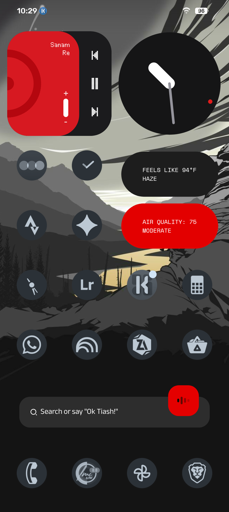
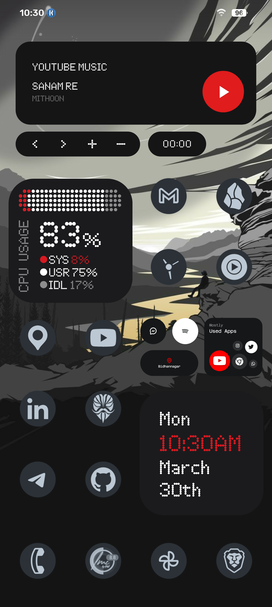
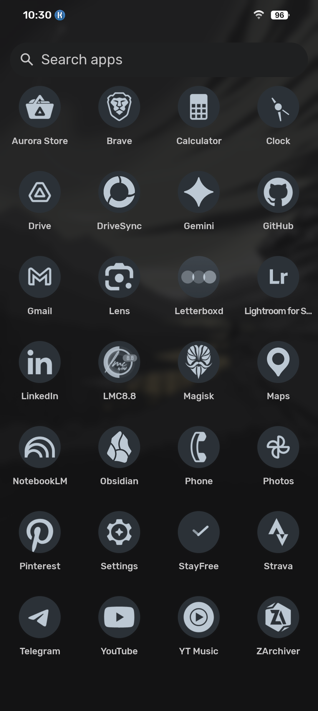
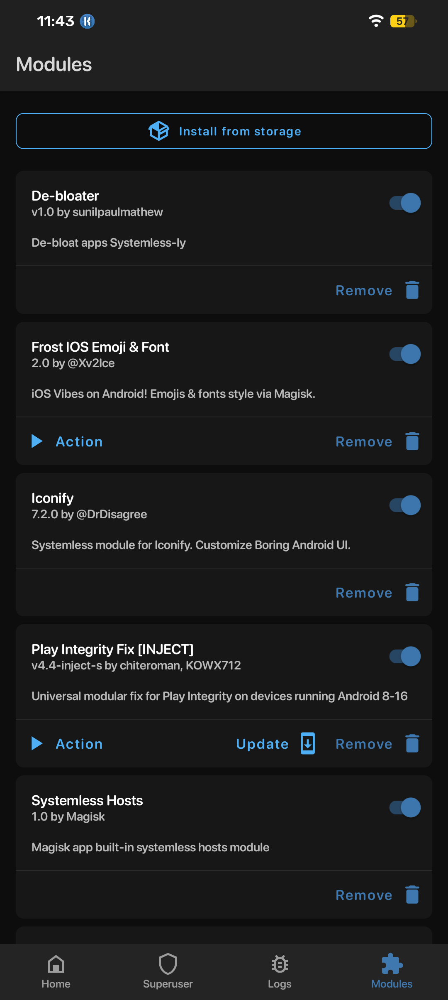
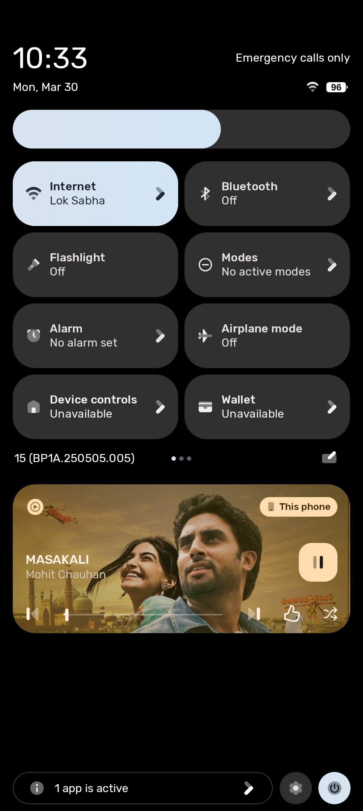
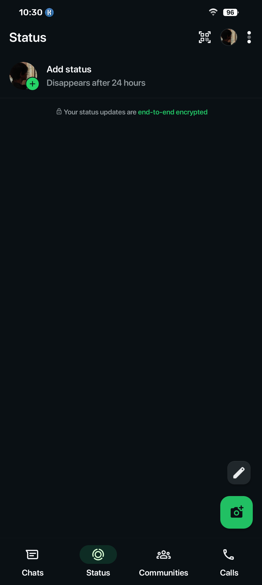
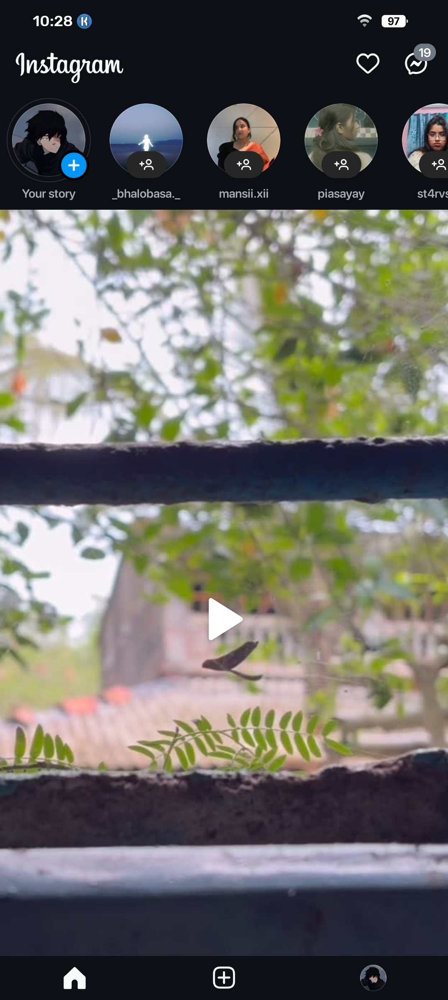
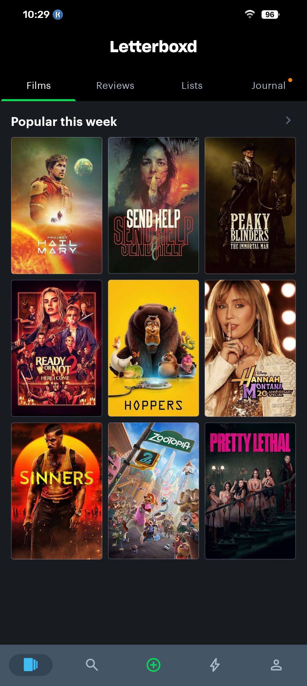

# De-Googled Root Android Architecture

A comprehensive deployment guide for a privacy-centric, de-googled, and rooted Android environment. This setup balances the removal of native telemetry with the retention of modern functionality through open-source frameworks and system-level modifications. [Click on this to visit the OS installation process.](https://github.com/Neuralized3/degoogled-magisk./blob/main/root.md) 

> **Deployment Legend**
> * **[AURS]**: Install via [Aurora Store](https://www.apkmirror.com/apk/aurora-oss/aurora-store-fdroid-version/)
> * **[RVX]**: Patch using [ReVanced Extended Manager or Download the patched ones listed in releases](https://github.com/thunderkex/revanced-extended/releases)

---

## 📱 Interface & Privacy logic

A visual overview of the de-googled environment, featuring system-wide theming and privacy-hardened application layouts.

### 🛠️ System Configuration

  
  
  

  <em>Customized Trebuchet Launcher with Iconify (Plumpy Icons) and Nothing 2.0 KWGT.</em>

### 🛡️ Root & Privacy Hardening

  
  

  <em>Left: Active Magisk/LSPosed module stack. Right: Quick-access privacy tiles for hardware sensors.</em>

### 🔓 Application De-bloating (RVX/Mods)

  
  
  
  

  <em>Distraction-free workflows: Shorts, Reels, Ads, and Channels successfully suppressed via ReVanced and LSPosed.</em>

## Base OS & Framework

* **Firmware:** [LineageOS](https://wiki.lineageos.org/devices/) (Locate device-specific builds via official wiki or [XDA Forums](https://xdaforums.com/)). If fallback Google Services are required, flash [MindTheGapps](https://gitlab.com/MindTheGapps).
* **Custom rom + Rooting guide:** [Click here](https://github.com/Neuralized3/degoogled-magisk./blob/main/root.md)
* **Service Emulation:** microG Services & Companion. Deployed via split configuration: [Root Base](https://github.com/microg/GmsCore/wiki/Downloads) and [ReVanced Base](https://github.com/TeamVanced/VancedMicroG/releases/tag/v0.2.24.220220-220220001). (If you installed MindtheGapps, skip microG entirely, you can directly download apps, however banking apps still might not work.)
* **Package Manager:** [Aurora Store](https://www.apkmirror.com/apk/aurora-oss/aurora-store-fdroid-version/) (Primary privacy-respecting client).

---

## System Modifications (Root Layer)

### Magisk Framework Environment
| Module | Developer / Version | Functionality |
| :--- | :--- | :--- |
| **[De-bloater](https://github.com/sunilpaulmathew/De-Bloater)** | sunilpaulmathew (v1.0) | Purges stock AOSP telemetry and bloatware (e.g., Recorder, FM Radio). |
| **[Frost IOS Emoji & Font](https://xdaforums.com/t/module-magisk-ksu-frost-ios-emojis-sf-font-v2-0.4759469/)** | @Xv2lce (v2.0) | Injects system-wide iOS typography. |
| **[Play Integrity Fix](https://github.com/KOWX712/PlayIntegrityFix/)** | chiteroman (v4.4-inject-s) | Bypasses API compliance checks and enables spoofing. |
| **Systemless Hosts** | Magisk Official (v1.0) | Enables system-wide, host-level ad blocking. |
| **[Zygisk - Vector](https://github.com/JingMatrix/Vector)** | JingMatrix (v2.0) | Core framework for hooking and LSPosed module support. |

### LSPosed Hooks & Modifications
| Hook | Developer / Repository | Functionality |
| :--- | :--- | :--- |
| **[FakeGapps](https://github.com/whew-inc/FakeGApps/releases)** | whew-inc | Enables strict signature spoofing necessary for microG. |
| **[Iconify](https://github.com/Mahmud0808/Iconify)** | Mahmud0808 | Advanced UI/UX customization (Status bar, notifications, theming). |
| **[Pixel Launcher Enhanced](https://github.com/Mahmud0808/PixelLauncherEnhanced)** | Mahmud0808 | Overrides default homescreen behavior and limits. |
| **[Wa Enhancer](https://github.com/Dev4Mod/WaEnhancer)** | Dev4Mod | Unlocks WhatsApp features and removes channel bloat. |

---

## Core System Utilities

* **Browser:** Brave **[AURS]** (Primary) or preferred hardened Chromium/Firefox fork.
* **File Management:** ZArchiver **[AURS]** (AOSP file manager replacement).
* **Input:** Gboard **[AURS]**.
* **Launcher:** Trebuchet (LineageOS Native).
* **AOSP Base Apps:** Calculator, Clock, Maps, Phone, Contacts, Messages, Settings, SIM Toolkit.
* **Communications:** Proton Mail **[AURS]** (Primary E2E) / Gmail **[AURS]** (Custom domain alias routing).
* **Telemetry tracking:** StayFree **[AURS]** (Digital wellbeing alternative).

---

## UI Customization

* **Widget Engine:** [Kustom Widget (KWGT)](https://docs.kustom.rocks/docs/downloads/download-kwgt/) (AOSP version to bypass premium limitations).
* **Asset Repositories:** [Nothing 2.0 KWGT (Adaptive)](https://9mod.com/nothing-2-0-for-kwgt.html), [ThinkPro KWGT](https://9mod.com/thinkpro-kwgt.html), and [Nothing GitHub Widgets](https://github.com/GXX0T/NotWidgets).

---

## Application Workflow

### Productivity & Development
* **Obsidian [AURS]:** Vault management and primary note-taking environment.
* **Autosync for Google Drive [AURS]:** Automated, encrypted cloud syncing for Obsidian vaults.
* **Google Drive [AURS]:** Remote PDF and document handling.
* **Google Maps [AURS]:** Navigation (Privacy Note: Manage location permissions explicitly via LineageOS/Android 15 settings, or substitute with OpenMaps).
* **GitHub [AURS]:** Repository and version control management.
* **NotebookLM [AURS]:** AI-driven research parsing.
* **Gemini & Google App [AURS]:** AI assistant dependencies.

### Media & Photography
* **Camera:** [LMC GCam Port](https://www.celsoazevedo.com/files/android/google-camera/) (Independent of Google Services; optimized color science in the lmc port, you can choose whichever is best for you, give it a shot.).
* **Gallery:** [Google Photos](https://github.com/thunderkex/revanced-extended/releases) **[RVX]** (Modded for unlimited cloud backup using rvx).
* **Editor:** [Lightroom for Samsung](https://github.com/thunderkex/revanced-extended/releases) **[RVX]**.
* **Video:** [YouTube](https://github.com/thunderkex/revanced-extended/releases) **[RVX]** (Ad-blocking, Shorts removal, SponsorBlock).
* **Audio:** [YouTube Music](https://github.com/thunderkex/revanced-extended/releases) **[RVX]** (Ad-free streaming architecture).

### Social & Networking
* **WhatsApp [AURS]:** Primary messaging (Hooked via Wa Enhancer).
* **Telegram [AURS]:** Modding repositories, developer support, and secure channels.
* **LinkedIn [AURS]:** Professional networking.
* **Pinterest [AURS]:** Visual referencing.
* **Letterboxd [RVX]:** Media logging and review archiving.
* **Strava [RVX]:** Telemetry and activity tracking.
* **MyInsta (Independent Modification):** * *Security Note:* Source independently and verify before installation. 
    * *Configuration:* Enable Ghost Mode. To disable Reels: Navigate to Developer Options > MetaConfigs > Search `panavision nav3` > Rewrite `tab1` and `tab3` to `home` > Save and restart. In MyInsta settings, disable feed reels and set reel scroll to one.
